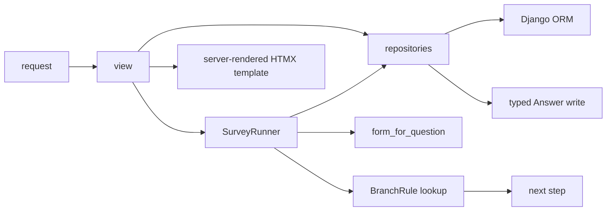

# Survey Form App

A Django 5 survey application with a server-rendered HTMX wizard, signed resume links, data-driven branching, staff-only results, exports, and a repository/service-class boundary.

## Stack

- Python 3.12+ (`pyproject.toml` requires `>=3.12`; CI uses 3.12)
- Django 5
- HTMX and django-htmx
- Tailwind CSS via the v3 CDN in `templates/base.html` (fine for local/demo; not recommended for production — no purge, larger payload, third-party dependency; swap to a built asset pipeline if you deploy)
- django-environ for settings via `.env` / `DATABASE_URL`
- SQLite for development; PostgreSQL-ready production settings through `DATABASE_URL`
- pytest-django, hypothesis (property tests on aggregators), ruff, black (local format), coverage
- **261 tests**, **100%** line coverage on `apps/surveys` (see `pyproject.toml` / `make coverage`)

## Quick Start

Copy `.env.example` to `.env` if you need to override defaults.

```powershell
python -m venv .venv
.\.venv\Scripts\python -m pip install -r requirements.txt
.\.venv\Scripts\python manage.py migrate
.\.venv\Scripts\python manage.py seed_survey --with-admin
.\.venv\Scripts\python manage.py runserver
```

Open `http://127.0.0.1:8000/`.

The seed command creates a published demo survey at **`/s/remote-work-readiness/`** (slug `remote-work-readiness`).

The demo staff user is **`admin` / `admin12345`** when seeded with `--with-admin` (also what `make seed` runs).

## What the app includes

- Public survey list, intro, and step wizard (`/s/<slug>/step/<order>/`)
- Session-backed responses with a path stack for **Back** and **Esc** (previous step in path)
- **BranchRule**-driven branching on single-choice answers
- Signed **resume** links (`/s/<slug>/resume/<token>/`)
- Staff **preview** mode (no answers saved): `/s/<slug>/preview/`
- Staff **results** dashboard, paginated **raw** responses with search, **CSV** and **JSON** exports (`/admin-results/<id>/…`)
- Django **admin** for survey authoring (plus Preview / Results links on `Survey`)

## Architecture



The core domain lives in `apps/surveys/`:

- `models.py` — surveys, questions, choices, branch rules, typed-column answers, responses
- `repositories.py` — `SurveyRepository`, `ResponseRepository`
- `runners.py` — `SurveyRunner` (wizard orchestration and branching)
- `navigation.py` — branch-aware `next_question()` / `choice_from_saved_response()` (no runner import cycle)
- `pathing.py` — session path rebuild from answers; branch-cycle detection on save
- `forms.py` — `form_for_question()` dynamic forms per question type
- `aggregators.py` — per-question results summaries and response metrics for the staff dashboard
- `tokens.py` — `issue_resume_token()` / `verify_resume_token()`
- `display.py` — answer formatting for exports and raw tables
- `templatetags/survey_extras.py` — `trim_decimal`, `duration`, `answer_display` template filters
- `managers.py` — custom querysets (`published`, `complete`, etc.)
- `signals.py` — auto-seed rating/likert choices; prune choices when a question type no longer accepts them
- `admin.py` — survey authoring inlines, post-save validation, Preview / Results links

Design notes: `docs/adr/` (seven architecture decision records). Full spec: `Survey Form.txt`.

Settings layout: `config/settings/base.py`, `dev.py`, `prod.py`.

## Useful Commands

From the repo root (requires [make](https://www.gnu.org/software/make/) on PATH):

```powershell
make migrate
make run
make test
make lint
make format
make coverage
make seed
```

| Target | What it runs |
|--------|----------------|
| `migrate` | `python manage.py migrate` |
| `run` | `python manage.py runserver` |
| `test` | `pytest` |
| `lint` | `ruff check .` |
| `format` | `black .` then `ruff check . --fix` |
| `coverage` | `coverage run -m pytest` + report with **100%** on `apps/surveys` (`pyproject.toml` `fail_under`) |
| `seed` | `python manage.py seed_survey --with-admin` |

Coverage omits migrations and tests under `apps/surveys` (see `pyproject.toml` and `Makefile`).

On Windows without `make`:

```powershell
.\.venv\Scripts\python manage.py migrate
.\.venv\Scripts\python -m pytest -q
.\.venv\Scripts\ruff check .
.\.venv\Scripts\black .
.\.venv\Scripts\python -m coverage run -m pytest -q
.\.venv\Scripts\coverage report --fail-under=100 --include="apps/surveys/*" --omit="*/migrations/*,*/tests/*"
.\.venv\Scripts\python manage.py seed_survey --with-admin
```

For production WSGI/ASGI, `config.wsgi` and `config.asgi` default to `config.settings.prod`. Local development uses `config.settings.dev` via `manage.py` and pytest.

## Continuous integration

GitHub Actions workflow: [`.github/workflows/ci.yml`](.github/workflows/ci.yml) — on push/PR to `main` or `master`:

1. `ruff check .` (black is available via `make format` locally; not enforced in CI)
2. `python manage.py migrate --noinput`
3. `coverage run -m pytest` with **fail-under=100** on `apps/surveys`

## Accessibility

Baseline accessibility (not a full WCAG audit):

- Skip link to main content; `<header>` and `<main id="main-content">`
- Every question field has a visible label; required questions include screen-reader-only “(required)”
- Validation errors use `role="alert"`, `aria-invalid`, and `aria-describedby` on the control (`forms._apply_accessibility_attrs`)
- Progress bar uses `role="progressbar"` on a 0–100 scale; draft toast uses `role="status"` and `aria-live`
- Keyboard: Tab through controls, Enter to submit, Esc to go back when `data-survey-back-url` is present
- After HTMX step swaps, focus moves to the first invalid field or `#question-label` (`htmx:afterSettle` in `base.html`)

Manual checks: keyboard-only pass through the demo survey; spot-check with NVDA or VoiceOver on intro, one step with an error, and completion.
