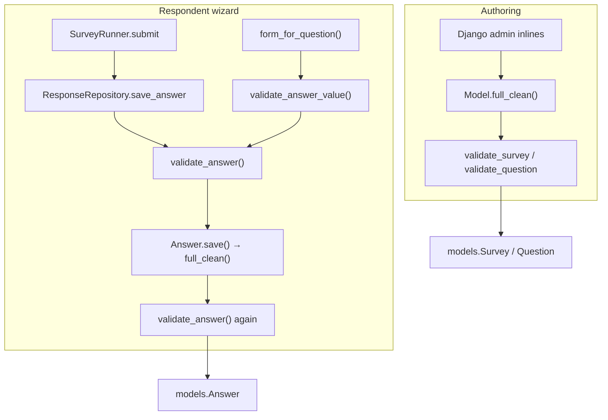

# Validation (single story)

All survey domain rules live in **`apps/surveys/validation.py`**. Other layers delegate to it; they do not re-implement limits or publish rules.

## Flow

## Layers

| Layer | What runs | Notes |
|-------|-----------|--------|
| **Constants** | `SHORT_TEXT_MAX_LENGTH`, `LONG_TEXT_MAX_LENGTH` in `constants.py` | Imported by `validation.py` and form widgets (HTML `maxlength` only). |
| **Models** | `clean()` → `validate_*`; `save()` → `full_clean()` | `Survey.save()` also runs `validate_survey_after_save()` so `Survey.objects.create(..., is_published=True)` cannot leave an empty published survey in the DB. |
| **Forms** | `QuestionForm.clean()` → `validate_answer_value()` | Same rules as `Answer`, including requiredness and text length. |
| **Repository** | `save_answer()` → `validate_answer()` before `Answer.save()` | Passes `choice_count` for multiple-choice so requiredness is checked before M2M is set. |
| **Admin** | `ValidateAfterSaveMixin` → `obj.full_clean()` | No duplicate rules; surfaces model errors and reverts invalid publish. |
| **JSON Schema** | `schema_contract.export_survey_definition()` | Export for clients/docs; optional `jsonschema` check via `validate_json()`. |

## Resume tokens

Resume links are signed `{response_uuid, survey_id}` tokens. A token is rejected when the **current browser session** already has a **newer** in-progress draft for the same survey (`ResponseRepository.is_resume_allowed`). Unrelated respondents (different or empty sessions) are unaffected.

## Branch rules

`BranchRule.clean()` remains on the model (branch cycles, same-survey checks). It is authoring-only and separate from answer shape validation.

## See also

- `Schema/README.md` — JSON Schema files and legacy generic demos
- `docs/adr/` — architecture decisions (signed resume, typed answers, branching)
